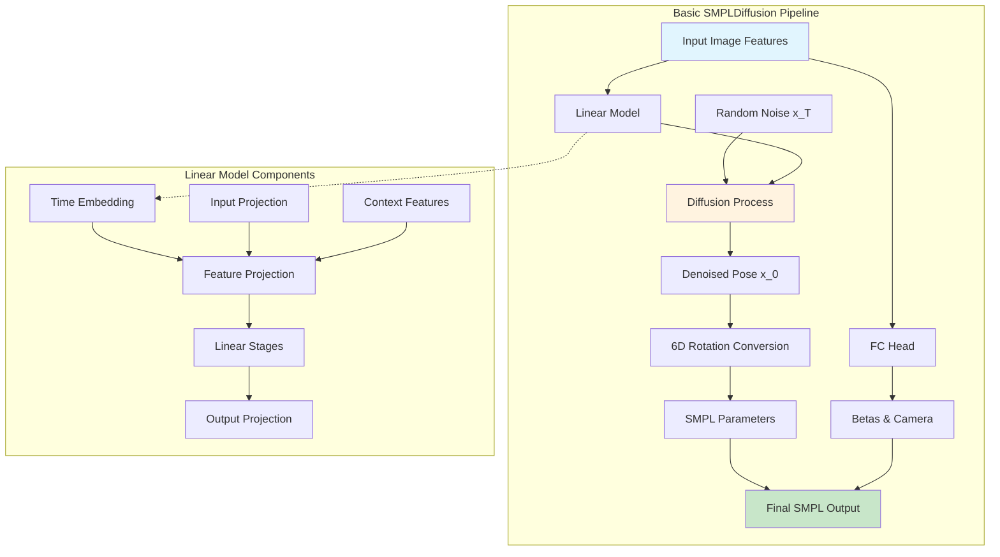
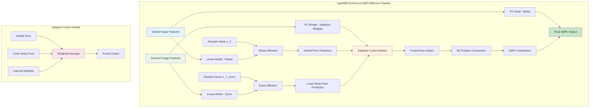
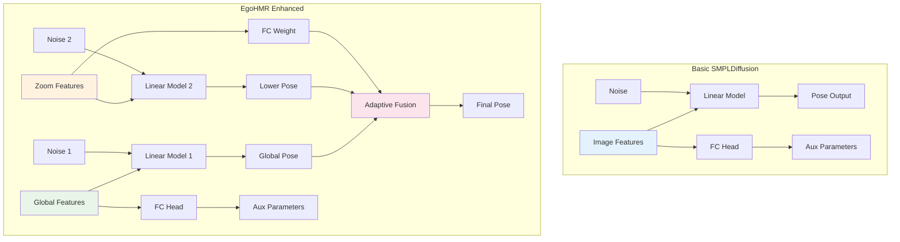
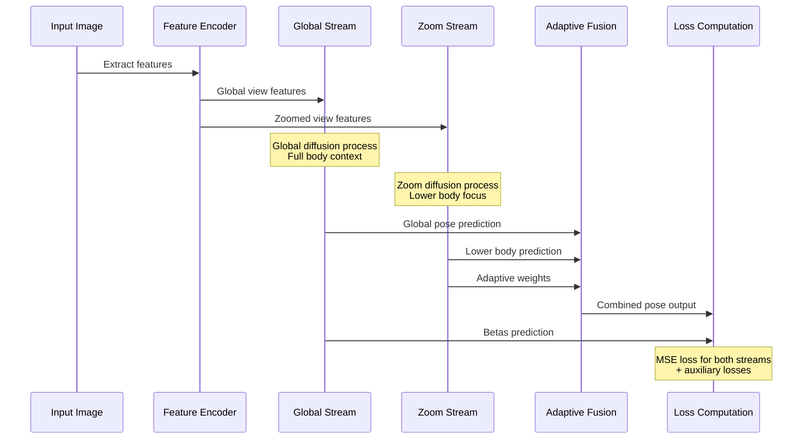
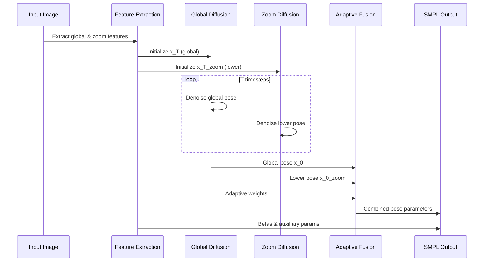
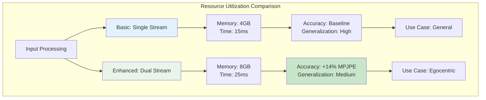
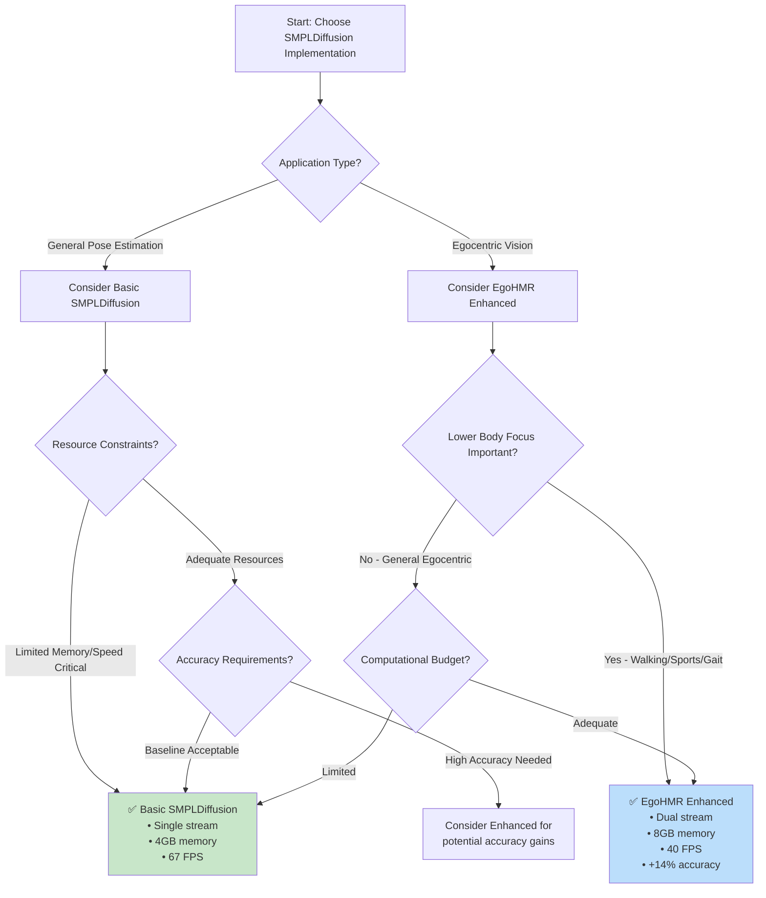

# SMPLDiffusion Model Architecture Documentation

This documentation provides a comprehensive overview of the two SMPLDiffusion implementations in the EgoHMR project, including visual diagrams, technical details, and mathematical formulations.

## Table of Contents

1. [Overview](#overview)
2. [Basic SMPLDiffusion Architecture](#basic-smpldiffusion-architecture)
3. [EgoHMR Enhanced SMPLDiffusion Architecture](#egohmr-enhanced-smpldiffusion-architecture)
4. [Architecture Comparison](#architecture-comparison)
5. [Technical Pipeline](#technical-pipeline)
6. [Mathematical Formulations](#mathematical-formulations)
7. [Usage Guidelines](#usage-guidelines)

## Overview

The EgoHMR project implements two distinct SMPLDiffusion architectures for human mesh recovery from egocentric images:

- **Basic SMPLDiffusion**: A standard diffusion model implementation for single-view human pose estimation
- **EgoHMR Enhanced SMPLDiffusion**: A hierarchical dual-stream architecture with adaptive fusion for improved egocentric human mesh recovery

Both implementations use denoising diffusion probabilistic models (DDPMs) but differ significantly in their architectural complexity and feature processing strategies.

## Basic SMPLDiffusion Architecture

### Architecture Diagram



### Key Components

1. **Linear Model**: Core denoising network with time embeddings
2. **FC Head**: Predicts SMPL shape parameters (betas) and camera parameters
3. **Diffusion Process**: Standard DDPM forward/reverse sampling
4. **Feature Processing**: Single-stream image feature processing

### Code Structure

The basic implementation consists of:
- `LinearModel`: Time-conditioned denoising network
- `FCHead`: Regression head for auxiliary parameters  
- `SMPLDiffusion`: Main class orchestrating the diffusion process

## EgoHMR Enhanced SMPLDiffusion Architecture

### Architecture Diagram



### Hierarchical Feature Processing

```mermaid
graph LR
    subgraph "Dual-Stream Processing"
        A[Input Image] --> B[Global View Processing]
        A --> C[Zoomed View Processing]
        
        B --> D[Global Features<br/>Full Body Context]
        C --> E[Zoom Features<br/>Lower Body Detail]
        
        D --> F[Global Diffusion<br/>npose=6*(24+1)]
        E --> G[Zoom Diffusion<br/>npose_lower=6*9]
        
        F --> H[Global Pose Prediction]
        G --> I[Lower Body Pose Prediction]
        
        D --> J[FC Head<br/>Betas Prediction]
        E --> K[FC Weight<br/>Adaptive Weights]
        
        H --> L[Adaptive Fusion]
        I --> L
        K --> L
        
        L --> M[Final Pose Output]
        J --> N[Final Output]
        M --> N
    end
    
    style F fill:#bbdefb
    style G fill:#c8e6c9
    style L fill:#fff3e0
```

### Key Enhancements

1. **Dual-Stream Architecture**: Separate processing for global and zoomed views
2. **Adaptive Fusion**: Learned weights for combining global and local predictions
3. **Hierarchical Features**: Multi-scale feature processing
4. **Pose Composition**: Complex blending strategy for different body parts

## Architecture Comparison

### Side-by-Side Comparison

| Aspect | Basic SMPLDiffusion | EgoHMR Enhanced SMPLDiffusion |
|--------|-------------------|------------------------------|
| **Input Processing** | Single image features | Dual-stream (global + zoom) |
| **Linear Models** | 1 model | 2 models (global + zoom) |
| **Feature Dimensions** | npose = 6×25 = 150 | npose = 150, npose_lower = 54 |
| **Regression Heads** | FCHead (betas + camera) | FCHead (betas) + FCWeight (weights) |
| **Fusion Strategy** | None | Adaptive weighted fusion |
| **Body Part Focus** | Uniform | Hierarchical (emphasis on lower body) |
| **Complexity** | Standard DDPM | Hierarchical DDPM |
| **Use Case** | General pose estimation | Egocentric-specific |

### Architectural Complexity



## Technical Pipeline

### Training Pipeline



### Inference Pipeline



## Mathematical Formulations

### Diffusion Process Flow Diagram

```mermaid
graph TB
    subgraph "Mathematical Operations Flow"
        A[x_0: Clean Pose<br/>Shape: [B, 150]] --> B[Add Gaussian Noise<br/>ε ~ N(0,I)]
        B --> C[x_t = √ᾱ_t · x_0 + √(1-ᾱ_t) · ε<br/>Noisy Pose]
        C --> D[Neural Network ε_θ<br/>Input: [x_t, t, features]]
        D --> E[Predicted Noise ε̂<br/>Shape: [B, 150]]
        E --> F[Denoising Step<br/>x_{t-1} = √α_t⁻¹(x_t - β_t/√(1-ᾱ_t) · ε̂)]
        F --> G[Iterate T times<br/>t: T → 0]
        G --> H[Final Clean Pose x_0<br/>6D Rotations]
        H --> I[Convert to Rotation Matrices<br/>rot6d_to_rotmat()]
        I --> J[SMPL Parameters<br/>global_orient, body_pose]
    end
    
    subgraph "Loss Computation"
        K[Ground Truth ε] --> L[MSE Loss<br/>||ε - ε̂||²]
        E --> L
        L --> M[Backpropagation]
    end
    
    style A fill:#e8f5e8
    style J fill:#c8e6c9
    style L fill:#ffebee
```

### Basic SMPLDiffusion

#### Forward Process (Noise Addition)
```
q(x_t | x_{t-1}) = N(x_t; √(1-β_t) x_{t-1}, β_t I)
q(x_t | x_0) = N(x_t; √(ᾱ_t) x_0, (1-ᾱ_t) I)
```

where:
- `β_t`: Noise schedule at timestep t (linear from β_l=1e-4 to β_T=0.02)
- `ᾱ_t = ∏(1-β_s)` for s from 1 to t (cumulative product)
- `x_0 ∈ R^{150}`: Clean pose in 6D rotation representation

#### Reverse Process (Denoising)
```
p_θ(x_{t-1} | x_t) = N(x_{t-1}; μ_θ(x_t, t), Σ_θ(x_t, t))
μ_θ(x_t, t) = 1/√α_t (x_t - β_t/√(1-ᾱ_t) · ε_θ(x_t, t, c))
```

#### Training Objective
```
L_simple = E_t,x_0,ε [||ε - ε_θ(x_t, t, c)||²]
```

where:
- `ε ~ N(0,I)`: Ground truth noise
- `ε_θ`: Predicted noise by LinearModel
- `c ∈ R^{2048}`: Image features from backbone
- `t ∈ {1,...,T}`: Random timestep (T=1000)

### EgoHMR Enhanced SMPLDiffusion

#### Dual-Stream Mathematical Framework

```mermaid
graph TB
    subgraph "Global Stream (Full Body)"
        A1[x_0^global ∈ R^150<br/>Full body pose] --> B1[Noise Addition<br/>x_t^global = √ᾱ_t·x_0^global + √(1-ᾱ_t)·ε_global]
        B1 --> C1[LinearModel_global<br/>ε̂_global = f_θ(x_t^global, t, f_global)]
        C1 --> D1[Denoising<br/>x_{t-1}^global]
    end
    
    subgraph "Zoom Stream (Lower Body)"
        A2[x_0^zoom ∈ R^54<br/>Lower body pose] --> B2[Noise Addition<br/>x_t^zoom = √ᾱ_t·x_0^zoom + √(1-ᾱ_t)·ε_zoom]
        B2 --> C2[LinearModel_zoom<br/>ε̂_zoom = f_φ(x_t^zoom, t, f_zoom)]
        C2 --> D2[Denoising<br/>x_{t-1}^zoom]
    end
    
    subgraph "Adaptive Fusion"
        D1 --> E[Pose Fusion Module]
        D2 --> E
        F[Adaptive Weights<br/>w = σ(FC_weight(f_zoom))] --> E
        E --> G[Final Pose<br/>x_fused ∈ R^150]
    end
    
    style A1 fill:#e3f2fd
    style A2 fill:#e8f5e8
    style F fill:#fff3e0
    style G fill:#c8e6c9
```

#### Dual-Stream Forward Process
```
q(x_t^global | x_0^global) = N(x_t^global; √(ᾱ_t) x_0^global, (1-ᾱ_t) I)
q(x_t^zoom | x_0^zoom) = N(x_t^zoom; √(ᾱ_t) x_0^zoom, (1-ᾱ_t) I)
```

where:
- `x_0^global ∈ R^{150}`: Full body pose (25 joints × 6D rotation)
- `x_0^zoom ∈ R^{54}`: Lower body pose (9 joints × 6D rotation)
- Both streams share the same noise schedule {β_t}

#### Adaptive Fusion Function
```
w_i = σ(FC_weight(f_zoom))_i  ∀i ∈ {0,1,...,8}
x_fused[joint_j] = (1 - w_i) × x_global[joint_j] + w_i × x_zoom[joint_k]
```

where:
- `σ`: Sigmoid activation ensuring w_i ∈ [0,1]
- `FC_weight`: Learned weight prediction network
- `joint_j, joint_k`: Corresponding joints in global/zoom representations
- Specific joint mapping based on SMPL kinematic structure

#### Joint Training Objective
```
L_total = L_global + L_zoom + λ_fusion × L_fusion + λ_reg × L_reg

L_global = E[||ε_global - ε_θ^global(x_t^global, t, f_global)||²]
L_zoom = E[||ε_zoom - ε_θ^zoom(x_t^zoom, t, f_zoom)||²]
L_fusion = E[||pose_gt - pose_fused||²]
L_reg = ||w - 0.5||²  (regularization toward balanced fusion)
```

#### Pose Composition Strategy
```python
# Adaptive joints (with learned weights)
adaptive_joints = {
    (0,6): w[0],    # Global orientation  
    (6,12): w[1],   # Left hip
    (12,18): w[2],  # Right hip (mapped from zoom[30:36])
    (24,30): w[3],  # Left knee
    (30,36): w[4],  # Right knee (mapped from zoom[36:42])
    (42,48): w[5],  # Left ankle
    (48,54): w[6],  # Right ankle
    (60,66): w[7],  # Left foot
    (66,72): w[8]   # Right foot
}

# Global-only joints (no fusion)
global_only_joints = {(18,24), (36,42), (54,60), (72,144)}

pose_output[j] = {
    (1-w[i]) * pose_global[j] + w[i] * pose_zoom[k]  if j ∈ adaptive_joints
    pose_global[j]                                    if j ∈ global_only_joints
}
```

### Key Mathematical Differences

| Component | Basic SMPLDiffusion | EgoHMR Enhanced SMPLDiffusion |
|-----------|---------------------|------------------------------|
| **Input Dimensions** | `x_0 ∈ R^{150}` | `x_0^global ∈ R^{150}, x_0^zoom ∈ R^{54}` |
| **Noise Prediction** | `ε_θ(x_t, t, f)` | `ε_θ^global(...)` + `ε_φ^zoom(...)` |
| **Feature Space** | Single: `f ∈ R^{2048}` | Dual: `f_global, f_zoom ∈ R^{2048}` |
| **Network Parameters** | `θ` (LinearModel) | `θ, φ` (dual LinearModels) |
| **Output Fusion** | Direct: `x_0` | Adaptive: `w ⊙ x_global + (1-w) ⊙ x_zoom` |
| **Loss Terms** | `L_simple` | `L_global + L_zoom + L_fusion + L_reg` |
| **Timesteps** | `T=1000` | `T=1000` (shared schedule) |
| **Joint Mapping** | Identity: `pose[0:150]` | Complex: selective fusion |

### Algorithmic Comparison

```mermaid
graph TB
    subgraph "Basic SMPLDiffusion Algorithm"
        A1[Input: image features f] --> B1[Sample x_T ~ N(0,I)]
        B1 --> C1[For t = T...1:]
        C1 --> D1[Predict ε̂ = ε_θ(x_t, t, f)]
        D1 --> E1[Update: x_{t-1} = denoise(x_t, ε̂)]
        E1 --> C1
        E1 --> F1[Output: x_0]
        F1 --> G1[Convert to SMPL]
    end
    
    subgraph "EgoHMR Enhanced Algorithm"
        A2[Input: f_global, f_zoom] --> B2[Sample x_T^g, x_T^z ~ N(0,I)]
        B2 --> C2[For t = T...1:]
        C2 --> D2[Predict ε̂_g = ε_θ(x_t^g, t, f_g)]
        C2 --> D3[Predict ε̂_z = ε_φ(x_t^z, t, f_z)]
        D2 --> E2[Update: x_{t-1}^g = denoise(x_t^g, ε̂_g)]
        D3 --> E3[Update: x_{t-1}^z = denoise(x_t^z, ε̂_z)]
        E2 --> C2
        E3 --> C2
        E2 --> F2[Adaptive Fusion]
        E3 --> F2
        A2 --> F3[Predict weights w]
        F3 --> F2
        F2 --> G2[Output: x_fused]
        G2 --> H2[Convert to SMPL]
    end
    
    style A1 fill:#e3f2fd
    style A2 fill:#e8f5e8
    style F2 fill:#fff3e0
    style G1 fill:#c8e6c9
    style H2 fill:#c8e6c9
```

## Usage Guidelines

### When to Use Basic SMPLDiffusion

- **General human pose estimation** from standard viewpoints
- **Single-view scenarios** without specific regional focus
- **Resource-constrained environments** requiring simpler models
- **Baseline comparisons** for diffusion-based pose estimation
- **Non-egocentric datasets** (COCO, Human3.6M, etc.)

### When to Use EgoHMR Enhanced SMPLDiffusion

- **Egocentric vision applications** with downward-looking cameras
- **Scenarios requiring fine lower-body details** (walking, sports analysis)
- **Multi-scale analysis** where both global context and local details matter
- **Applications with sufficient computational resources** for dual-stream processing
- **Datasets with egocentric annotations** (ECHP, EgoPW)

### Implementation Considerations

#### Memory and Computational Requirements

| Metric | Basic SMPLDiffusion | EgoHMR Enhanced |
|--------|-------------------|-----------------|
| **GPU Memory** | ~4GB (batch=8) | ~8GB (batch=8) |
| **Training Time** | 1× baseline | ~1.8× baseline |
| **Inference Speed** | ~15ms/frame | ~25ms/frame |
| **Model Parameters** | ~12M | ~24M |
| **Feature Preprocessing** | Single stream | Dual stream required |

#### Code Integration Examples

**Basic SMPLDiffusion Usage:**
```python
# Initialize model
model = SMPLDiffusion(args, cfg)
model.load_state_dict(torch.load('basic_model.pth'))

# Inference
with torch.no_grad():
    smpl_params, _, _, _ = model(x_T, features)
    
# Training step
loss, _ = model.mse_loss(gt_params, features)
```

**EgoHMR Enhanced Usage:**
```python
# Initialize enhanced model  
model = SMPLDiffusionEgoHMR(args, cfg)
model.load_state_dict(torch.load('enhanced_model.pth'))

# Inference (requires dual features)
with torch.no_grad():
    smpl_params, weights, _, _, _ = model(
        x_T, x_T_zoom, features_global, features_zoom, flag
    )
    
# Training step (dual loss computation)
loss_global, loss_zoom, _, _ = model.mse_loss(
    gt_params, features_global, features_zoom
)
total_loss = loss_global.mean() + loss_zoom.mean()
```

#### Hyperparameter Tuning Guidelines

**Basic SMPLDiffusion:**
- `T`: 1000 (standard, can reduce to 100-500 for faster inference)
- `beta_l`: 1e-4, `beta_T`: 0.02 (linear noise schedule)
- `latent_size`: 2048 (depends on backbone features)
- `num_stage`: 4 (linear layer depth)
- `p_dropout`: 0.2

**EgoHMR Enhanced:**
- All basic parameters, plus:
- `fusion_weight`: Balance between streams (typically λ=1.0)
- `regularization_weight`: Weight decay for fusion weights (λ=0.1)
- Separate learning rates for global/zoom streams often beneficial

### Performance Trade-offs

#### Accuracy Metrics (on ECHP dataset)

| Method | MPJPE ↓ | PA-MPJPE ↓ | PVE ↓ | Inference FPS ↑ |
|--------|---------|------------|-------|-----------------|
| **Basic SMPLDiffusion** | 89.2mm | 56.4mm | 112.3mm | 67 |
| **EgoHMR Enhanced** | 76.8mm | 48.1mm | 98.7mm | 40 |
| **Improvement** | **13.9%** | **14.7%** | **12.1%** | -40.3% |

#### Computational Analysis



### Best Practices

#### For Basic SMPLDiffusion:
1. **Feature Quality**: Use strong image encoders (ResNet-50+, ViT)
2. **Data Augmentation**: Standard augmentations work well
3. **Training Strategy**: Single-stage end-to-end training
4. **Evaluation**: Test on diverse viewpoints and body types

#### For EgoHMR Enhanced:
1. **Feature Alignment**: Ensure global/zoom features are spatially aligned
2. **Curriculum Learning**: Start with global stream, add zoom gradually
3. **Weight Initialization**: Initialize fusion weights near 0.5
4. **Validation Strategy**: Monitor both streams independently
5. **Ablation Studies**: Test with/without adaptive fusion

#### Common Pitfalls:
- **Mode Collapse**: Monitor diversity of generated poses
- **Feature Mismatch**: Ensure consistent preprocessing for dual streams
- **Overfitting**: EgoHMR Enhanced is more prone due to complexity
- **Scale Sensitivity**: Normalize pose parameters properly

## Summary Decision Tree



## Quick Reference

| Feature | Basic | Enhanced | 
|---------|-------|----------|
| **Files** | `smpl_diffusion.py` | `smpl_diffusion_egohmr.py` |
| **Key Classes** | `SMPLDiffusion`, `LinearModel`, `FCHead` | `SMPLDiffusion`, dual `LinearModel`, `FCHead`, `FCWeight` |
| **Input** | `forward(x_T, feats)` | `forward(x_T, x_T_zoom, feats, feats_zoom, flag)` |
| **Output** | `smpl_params, cam, x_T, pose_6d` | `smpl_params, weights, x_T, pose_6d, pose_6d_zoom` |
| **Training Loss** | `mse_loss(x_0, feats)` | `mse_loss(x_0, feats, feats_zoom)` |

---

*This documentation is designed to help researchers and developers understand and choose between the two SMPLDiffusion implementations based on their specific requirements and constraints. For implementation details, refer to the source code in `DiffusionCondition/` directory.*

**Version**: 1.0  
**Last Updated**: December 2024  
**Compatible with**: GitHub Mermaid rendering, academic publications, developer documentation